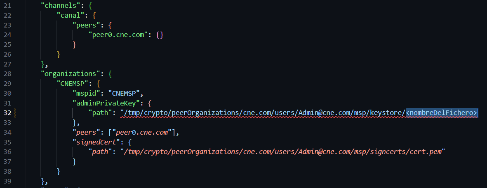

# HLF_cne

# Instalar prerrequisitos

1.- Ingresar al directorio Prerequisitos/ y ejecutar installer.sh

`sudo sh installer.sh`

# Pasos para levantar la infraestructura

1.- Verificar que no exista algun contenedor levantado

`sudo docker ps -a`

1.1 Si existe un contenedor levantado, eliminarlo con

`sudo docker rm -f <nombre del contenedor>`

2.- Posicionarse en el directorio cne-network/ y ejecutar init.sh

`sudo ./init.sh`

3./ Configurar variables de entorno ejecutando envs.sh

`source ./envs.sh`

4.- Levantar el contenedor de IPFS, situarse en el directorio asset-transfer-basic/applications-gateway-go/artifacts/ y ejecutar compose.sh

Nota: El contenedor se levantará en localhost:5001/webui

`sudo sh composeIPFS.sh`

5 .- (OPCIONAL) Levantar el explorador de hyperledger Fabric

5.1 .- Situarse en el directorio explorer/ y abrir el fichero compose.sh

5.2 .- copiar la línea de código marcada en comentario y ejecutarla con un usuario sudo

`export KEYSTORE_FILE=$(sudo ls -t "$PWD"/../cne-network/organizations/peerOrganizations/cne.com/users/Admin\@cne.com/msp/keystore/*_sk | head -n 1)`

5.3.- Copiar el nombre del fichero al final del path

5.4.- Remplazar el valor previamente copiado en el archivo explorer/connection-profile/test-network.json

5.5 .- Situarse en el directorio explorer/ y crear un softlink al directorio organizations/

`ln -s ../cne-network/organizations .`

Notal: el explorador se levantará en localhost:8080

Hasta este punto está levantado lo siguiente:

✅ Red de contenedores de Hyperledger

✅ Contenedor de IPFS

✅ Explorador de Hyperledger Fabric

# Pasos para interactuar con la App de Fabric

1.- Posicionarse en el directorio asset-transfer-basic/application-gateway-go y ejecutar app.sh

`sudo ./app.sh`

Se mostrara una guia con las  opciones de la aplicación 

=================== Inicio Fabric application-gateway-go V1.0===================

Uso: FabricApp <command> [<args>]

Commands:

*******Identidad de cdas*******

-> makedirs <cda.txt-path>  Crea un sistema de carpetas que describe la estructura Provincia.Canton.Parroquia.Recinto en base al fichero cda.txt

-> regscanners <cdaParentFolder-path> Crea material criptográfico y registra en la cadena de bloques cada dispositivo descrito como cda. Si <cdaParentForlde-Path> es creado con Makedirs, no se requiere el path

-> worldstate Devuelve los registros actualmente almacenados

*******Procesamiento de Actas*******

-> registraracta <acta-path> Almacena en IPFS y registra en hyperledger fabric la transacción, el acta entregada mediante el path cada dispositivo descrito como cda

-> consultaracta <CID> En base a un CID devuelve el acta asociada

-> historicoacta <CID> En base a un CID devuelve todas las versiones asociadas

-> eliminaracta <CID> En base a un CID, elimina el acta del worlstate

-> verresultados Muestra la tabla de resultados actual

\*******************************
